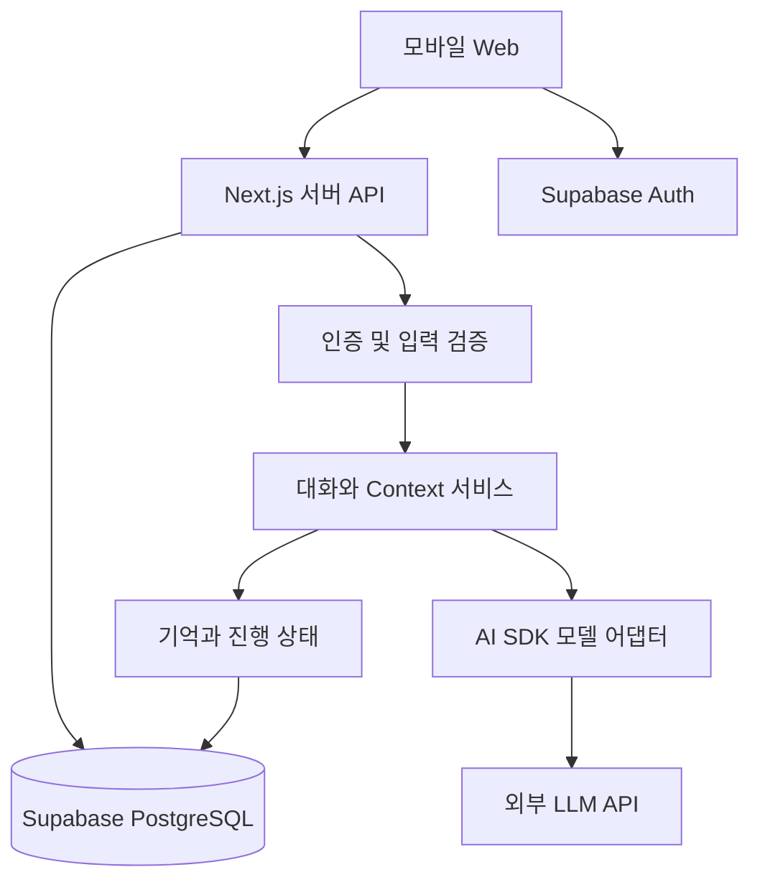

# ieum — TypeScript 로드맵과 시스템 설계

버전: 0.1 · 작성일: 2026-09-15 · 최종 갱신: 2026-09-16 · 상태: S0~S2 구현 완료, S3 이후는 계획

방향의 기준은 `01-project-direction.md`, 선택 이유는 `03-decisions.md`, 실제 진행률은 `04-status-and-handoff.md`를 따른다. **S3 이후의 상세 설계는 `05-conversations-topics-and-map.md`가 갖는다.** 이 문서의 S3·S4 항목과 05가 어긋나면 05를 따르고 그 이유를 03에 남긴다. S0~S2는 실제로 구현해 배포했다. 아래 상세 구현 중 S3 이후 항목은 기본 제안이며 아직 만들지 않은 것이다.

## 1. 단계와 진입 조건

| 단계 | 결과 | 주요 범위 | 완료 기준 |
| --- | --- | --- | --- |
| S0 배포 기반 | 폰에서 접근하는 개인 웹 | Next.js, Supabase Auth, 접근 제한, Vercel | 본인 로그인·로그아웃 및 비인증 차단 확인 |
| S1 저장되는 대화 | 새로고침 후 대화 복원 | 모델 1개, 메시지 저장, 오류·사용량 | 새로고침·새 접속 후 이력 유지, 키 미노출 |
| S2 명시적 기억 | 직접 관리할 수 있는 기억함 | 등록, 근거, 수정, 삭제 | 변경/삭제 후 응답에도 반영 |
| S3 맥락의 연속성 | 다음 날 작업 이어가기 | 대화 목록, 주제(Topic)와 구간(Segment), 진행 중인 일·결정·다음 행동, Context | 새 대화에서 작업 재개·완료 반영 |
| S4 자동 기억과 검색 | 중요한 내용 선별 | 후보 추출, 검증, 작업 복구, hybrid 검색, 자동 주제 발견과 관계도 | 고정 평가셋 비교, 중복·정정·삭제 회귀 확인 |
| S5 피드백 개인화 | 상황에 맞는 응답 | 명시 피드백, 기한 있는 선호, 정체성 버전 | 사용자 확인된 선호 적용·취소 가능 |
| S6 선제 브리핑 | 필요한 변화 안내 | RSS/Calendar부터, 시간대, 빈도 제한 | 수집 실패 구분, 중복 방지, 유용함 기록 |
| S7 제한된 행동 | 승인한 작업 실행 | Tool, 인자 고정 승인, 감사 기록 | 무승인 실행 차단·timeout 중복 방지 |
| S8 음성/Companion | 관측 범위 확장 | 수동 녹음부터 실험 | 지연·품질·권한·비용 평가 후 확대 |

S0~S3이 첫 실사용 묶음이다. 사용성의 확인 없이 S6 이후의 연동 수를 늘리지 않는다. 각 단계에서 실제 사용하고 다음 범위를 조정한다. 주간 가용 시간이 미정이므로 달력 마감은 확정하지 않는다. S0와 S1의 실제 소요를 기록한 뒤 다음 작업을 추정한다.

## 2. 초기 구조

초기 배포는 Vercel에 UI와 서버 API, Supabase에 Auth와 DB를 둔다. 서버 코드는 Node.js 런타임을 기본 제안으로 삼고 실제 SDK 호환성을 확인한다. 처음부터 Redis·Queue 서비스·별도 Worker·NestJS를 추가하지 않는다.

중요한 비즈니스 변경은 Next.js 서버를 통과시킨다. Supabase Auth의 로그인과 데이터 접근 권한 검사는 별개다. DB에는 RLS를 적용하고, 관리자 키로 우회하는 경로에서는 소유권을 서버가 별도로 검사한다. LLM 키와 관리자 키는 클라이언트 번들 및 NEXT_PUBLIC 변수에 두지 않는다.

## 3. 코드 경계 제안

| 위치 | 책임 |
| --- | --- |
| app/ | 페이지, 모바일 UI, 라우팅 |
| app/api/ | 인증·요청 검증·서비스 호출·응답 |
| src/server/conversation/ | 메시지 저장, 생성 상태, 요청 중복 방지 |
| src/server/memory/ | 명시 기억, 정정, 삭제, 이후 자동 추출 |
| src/server/context/ | 기본 정보·최근 대화·작업 상태·검색 결과 조합 |
| src/server/work/ | 진행 중인 일·결정·다음 행동 |
| src/server/models/ | 작업별 모델 매핑, timeout, 사용량 |
| src/server/db/ | DB 접근, 원자적 변경, 사용자 범위 |
| src/server/validation/ | 외부 요청 및 LLM 출력 스키마 |

permission, integration, jobs는 해당 단계에 추가한다. route.ts가 NextRequest나 쿠키를 다루고, 핵심 서비스는 사용자 ID와 검증된 DTO를 받는다. 복잡한 DI 컨테이너나 모든 클래스의 인터페이스 추출은 초기 필요가 없다.

## 4. 데이터 모델의 출발점

아래는 논리 구조다. SQL 타입·인덱스·RLS의 실제 migration은 각 단계에서 작성한다.

| 단계 | 데이터 | 필수 정보 |
| --- | --- | --- |
| S0 | owner_access | 허용된 사용자 ID, 활성 상태 |
| S1 | conversations | ID, owner, 제목, 생성/수정 시각 |
| S1 | messages | conversation, 순서, role, content, 생성 상태, client_request_id |
| S1 | model_calls | task, model, 사용 토큰, 상태, 지연, 예상 비용 |
| S2 | memories | owner, kind, 내용, 출처, 상태, 유효 시점, version |
| S2 | memory_evidence | memory, source_message, 최소 근거, 출처 종류 |
| S3 | work_items | 제목, 목표, 진행/보류/완료, 다음 행동, 마지막 확인 시각 |
| S3 | work_decisions | work_item, 결정, 이유, 근거, supersedes |
| S4 | jobs | 타입, 상태, dedupe_key, attempts, lease, 추출 커서 |
| S4 | embeddings | memory와 버전, 모델, 차원, 벡터, content_hash |
| S3 | topics / conversation_segments / topic_segments | 주제, 구간, 연결 근거와 사용자 override |
| S4 | topic_aliases / topic_summaries / topic_relations | 후보 조회, 유효 요약, 근거 있는 주제 관계 |
| S5 | feedback/preferences | 적용 상황, 선호, 확인 여부, 만료, 출처 |

Supabase auth.users를 로그인 정체성으로 사용한다. 등록 허용 방식은 S0에서 선택하되 공개 사용자 가입을 제품 기능으로 만들지 않는다. 모든 업무 데이터에 소유자 범위를 둔다.

S2 kind는 FACT/PREFERENCE/GOAL/EPISODE를 제안한다. 단일 사실 정정은 이전 버전을 닫고 새 버전을 활성화한다. 서로 양립하는 복수 목표를 단순 최신값으로 덮어쓰지 않는다.

사용자가 ‘기억해줘’라고 입력한 의미를 처음부터 자연어 분류기로 판단할 필요는 없다. 메시지의 ‘기억으로 저장’ 동작이나 기억함 등록 폼부터 구현한다. 자동 자연어 추출은 S4에 속한다.

## 5. 요청 및 실패 처리

S1의 순서는 인증 → 요청 검증 → 사용자 메시지 저장 → 제한된 최근 대화 구성 → 모델 호출 → 답변과 usage 저장이다. 첫 세로 기능은 일반 JSON 응답으로 검증하고 스트리밍을 추가해도 된다.

- client_request_id로 중복 제출 방지. 같은 ID의 다른 입력은 거절한다.
- 모델 생성 상태는 pending/completed/failed/partial 등으로 명시한다.
- 한 대화의 동시 생성 제한을 제안한다. 끊긴 생성은 lease/상태 확인으로 복구한다.
- 외부 API를 기다리는 동안 DB 트랜잭션을 유지하지 않는다.
- 여러 Supabase REST 호출을 묶었다고 하나의 트랜잭션이 되지는 않는다. 정정·승인 등 원자적 변경은 DB 함수/RPC 또는 적절한 서버 DB 트랜잭션 경로로 구현한다.
- 오류를 숨기거나 답변 저장 실패를 완료로 표시하지 않는다.

## 6. Context의 진화

### S1~S3

시스템 원칙 → 확인된 기본 정보 → 선택된 진행 작업/결정 → 제한된 최근 대화 → 현재 질문으로 구성한다. 현재 질문은 잘라내지 않는다. 오래된 정보를 우선 제거하고 요청 크기 상한을 적용한다.

활성 기억이 적으면 고정 상한 내 전달하고, 작업이 여럿이면 사용자가 현재 작업을 선택하게 한다. 애매한 ‘그 일’에 대해 임의로 작업을 확정하지 않는다. 모델에 전달한 기억은 화면에서 확인할 수 있게 한다.

초기 입력 예산 6,000토큰과 출력 1,000토큰을 출발 제안으로 둔다. 공급자와 한글 토큰량 확인 후 조정한다. 월 예산·모델 ID·실제 단가는 아직 미정이다.

### S4 이후

owner·상태·유효 시점 필터 → 벡터/키워드 후보 → RRF → 중복·구버전 제거 → 토큰 상한 순서로 검색한다. 가중치와 임계값은 평가셋으로 정한다. 관련 기억이 없으면 0개를 허용한다.

날짜가 있는 과거 질문에는 당시 유효했던 기억을 사용한다. 현재 일정의 사실은 기억보다 외부 원본의 최근 조회를 우선한다. 임베딩 모델은 생성 모델과 따로 고정하며 모델 변경 시 재임베딩 계획을 세운다.

## 7. 기억 생명주기와 삭제

S2부터 출처·수정 이력·삭제를 구현한다. ‘기억에서 잊기’와 ‘원문까지 삭제’를 화면에서 구분한다. 기억 삭제 후 그 출처 메시지를 Context에서 계속 읽어 동일 사실을 다시 제시하지 않도록 제외 상태를 둔다.

S4 자동 추출은 후보 제안 → 출처 검증 → 중복/충돌 판정 → 저장 → 임베딩으로 나눈다. 모델이 제시한 source ID를 그대로 신뢰하지 않는다. AI 답변·외부 자료는 사용자가 직접 밝힌 사실로 승격하지 않는다. 모호한 추론은 확인 후보로 남긴다.

자동 추출이 생기면 삭제 경합을 막는 사용자/기억 버전과 tombstone을 추가한다. 삭제 시 관련 벡터·근거·요약을 제거/무효화하고 진행 중 job의 오래된 결과 commit을 차단한다. 복제 내용의 완벽한 의미 추적 대신 초기에는 관련 대화 Context를 넓게 제외하는 보수적 처리를 허용한다.

원문 보관 기간과 백업 정책은 배포 전 선택한다. 이전 Spring 문서의 30일은 이번 버전에서 자동 확정된 값이 아니다. 로그에 전체 프롬프트·개인정보·토큰을 기본 출력하지 않는다.

## 8. 자동화와 권한의 확장

S6 첫 연동부터 Tool allowlist, 소유권, 계정·기간·건수 제한을 적용한다. 권한 계층 전체를 S7까지 미루지 않는다. S7은 승인 UI와 외부 쓰기 실행을 추가하는 단계다.

브리핑은 처음에 앱 최초 접속 시 생성 또는 정해진 시간대 생성 중 하나를 선택한다. 고정 UTC 실행 슬롯과 사용자 시간대를 구분하며 UNIQUE(rule, slot)로 중복 방지한다. 수집 실패와 결과 0건을 구분한다.

상시 Worker가 없는 초기 환경에서 응답 후 실행은 짧은 최선 노력 작업으로만 사용한다. 먼저 DB에 작업을 기록하고, 앱 재접속/후속 요청/설정된 스케줄에서 미완료 작업을 회수한다. 사용자가 접속하지 않으면 즉시 복구가 보장되지 않는다는 한계를 기록한다. 지속 복구가 필요해지면 TypeScript Worker와 영속 Queue를 검토한다.

쓰기 승인은 대상·정규화 인자·해시·만료·승인자를 고정한다. 실행 직전 최신 정책을 검사한다. timeout 후 성공 여부가 불명확하면 UNKNOWN 상태로 두고 확인 없이 재전송하지 않는다. 친밀함·모델 추론·외부 본문의 지시가 권한을 바꾸지 못한다.

## 9. 비용과 배포

- 첫 모델 Provider는 하나만 실제 연동하고 AI SDK 뒤에서 작업별 별칭을 둔다.
- 요약·추출은 작은 배치로, 전체 대화를 매번 재처리하지 않는다.
- API 사용량은 S1부터 기록하고 요청/출력/동시 호출 상한을 적용한다.
- 비용 계산이 가능한 Provider 선택 후 월 예산 예약·정산을 추가한다. 실패 호출을 무조건 0원으로 취급하지 않는다.
- 무료 서비스 요금·시간 제한·비활성 중지·백업 지원은 배포 당시 공식 문서로 재확인한다. 무료 운영을 영구 보장하지 않는다.
- Next.js 배포 환경의 제한과 TypeScript의 기능 한계를 혼동하지 않는다. 장기 작업만 별도 Node.js Worker로 이동할 수 있다.

참고할 공식 문서: [Next.js BFF](https://nextjs.org/docs/app/guides/backend-for-frontend), [AI SDK](https://ai-sdk.dev/docs/introduction), [Supabase](https://supabase.com/docs), [Vercel Hobby](https://vercel.com/docs/plans/hobby). 이 문서 작성에서는 요금과 버전의 새 실시간 검증을 수행하지 않았으며 구체적 수치를 확정하지 않는다.

## 10. S0 상세 Task

모든 항목은 TODO다. 아래 파일명은 예정 경로이며 현재 생성된 코드가 아니다.

| ID | 작업 | 완료 조건 | 학습 포인트 |
| --- | --- | --- | --- |
| S0-01 | 작업 환경·저장소·기존 지침 확인 | 새 프로젝트 위치와 repo 상태 기록, 기존 파일 미덮어쓰기 | npm, package.json, 프로젝트 구조 |
| S0-02 | 버전·패키지 선택 후 Next.js 생성 | TypeScript strict, lockfile, 개발 구동 및 production build | type, import/export |
| S0-03 | 모바일 화면 골격 | 로그인/대화 빈 화면, 360px에서 넘침 없음 | props, 상태, 이벤트 |
| S0-04 | Supabase 프로젝트·환경 변수 연결 | 서버/브라우저 키 구분, 예제 env에 실제 비밀값 없음 | 서버와 클라이언트 경계 |
| S0-05 | 단일 소유자 인증 | 검증된 세션, owner allowlist, 로그인/로그아웃, 비인증 거절 | Promise, 오류 처리 |
| S0-06 | RLS·서버 접근 검사 | 허용되지 않은 계정과 비인증 요청의 데이터 접근 거절 | 인증과 인가의 구분 |
| S0-07 | Vercel 배포·휴대폰 확인 | URL, 환경 변수, 인증 redirect, 폰 접속 증거 기록 | build와 배포 |
| S0-08 | 상태와 배운 내용 기록 | 완료 Task, 검증 명령/결과, 다음 Task, 알려진 문제 갱신 | 코드 흐름 설명 |

인증 방식 기본 제안은 본인 한 명을 미리 허용하는 방식이다. 이메일 링크/비밀번호/OAuth의 실제 선택은 S0-04~05 시점에 계정·설정 비용을 확인해 결정한다. 사용자 ID·이메일·프로젝트 ID는 추측하지 않는다.

S0 검증은 인증/인가 실패 경로와 build, 모바일 접속에 집중한다. 스타일만 확인하는 불필요한 테스트를 늘리지 않는다. S0에는 모델 호출을 넣지 않는다.

## 11. S1~S3 백로그

| ID | 작업 | 선행 | 완료 기준 |
| --- | --- | --- | --- |
| S1-01 | conversation/message schema·RLS | S0 | 소유자 범위 저장/조회 |
| S1-02 | AI SDK Provider와 usage | S0 | 성공·실패·사용량 저장, 키 미노출 |
| S1-03 | 대화 API·중복 방지 | S1-01/02 | 동일 요청 재시도 중복 없음 |
| S1-04 | 대화 UI·복원·오류 | S1-03 | 새로고침 복원, 실패 표시 |
| S1-05 | 스트리밍 및 중단 상태 | S1-04 | 완료/부분/실패 구분 |
| S2-01 | 기억/evidence schema·명시 등록 | S1 | 출처가 있는 기억 |
| S2-02 | 기억함·정정·삭제 | S2-01 | 수정 충돌 처리와 삭제 반영 |
| S2-03 | 제한된 기억 Context | S2-02 | 새 대화에서 활용, 삭제 내용 미사용 |
| S3-A | 대화 목록·선택·새 대화·제목 변경·복원 | S2 | 기존 메시지 보존, 생성 중 전환해도 원래 대화에만 저장 |
| S3-B | Topic·Segment 연결과 주제 상세 | S3-A | 여러 대화의 일부를 한 주제로 모으되 원문 이동 없음 |
| S3-C | work_items/decisions와 작업 Context | S3-B | 다음 날 마지막 결정·다음 행동 재개, 완료 작업 반복 없음 |

S1-01~05와 S2-01~03은 완료했다. S3의 세부 구분은 `05-conversations-topics-and-map.md`의 PR 백로그를 따른다. 원래 이 문서의 S3-01~03은 위 S3-C에 해당한다.

S4는 자동 기억 추출에 더해 자동 주제 발견(S4-A)과 주제 관계도(S4-B)를 포함한다. 임베딩 기반 대화 지도는 그 뒤의 실험이다. 해당 단계 진입 전에 Task를 상세화하며, 지금 대규모 완성 스키마를 미리 만들지 않는다.

## 12. 연속성 평가 시나리오

| ID | 입력 상황 | 기대 결과 |
| --- | --- | --- |
| E01 | 새 대화에서 저장한 기술 선택 질문 | Next.js/Supabase 결정과 근거 활용 |
| E02 | 진행 작업에서 ‘다음은?’ 질문 | 마지막 결정과 미완료 다음 행동 안내 |
| E03 | 다음 행동 완료 처리 후 재질문 | 완료한 작업을 반복 권유하지 않음 |
| E04 | 기억을 명시적으로 정정 | 현재 답변에는 새 사실 사용 |
| E05 | 기억 삭제 후 새/기존 대화 질문 | 삭제 기억과 파생 Context 미사용 |
| E06 | 개인 정보가 저장되지 않은 질문 | 추측하지 않고 모름/확인 필요 표시 |
| E07 | 서로 다른 진행 작업 두 개 | 임의로 섞지 않음 |
| E08 | ‘오늘만 짧게’라는 요청 | 영구 선호로 저장하지 않음 |
| E09 | 오래된 상태만 있는 질문 | 마지막 확인 시점과 불확실성 표시 |
| E10 | 모델 API 실패 후 재시도 | 사용자 입력 보존·중복 답변 방지 |

실제 관측 결과를 기록하고, 통과 수치만으로 일반적 무오류를 주장하지 않는다. S4에서는 검색 비교셋, S7에서는 악성 입력·무승인 실행 회귀셋을 추가한다.

## 13. 구현하면서 배우는 방식

각 작업에서 ① 입력·출력 ② Java/Spring 대응 개념 ③ 비동기 대기 위치 ④ 실패 시 남는 상태를 설명한다. 전체 코드 일괄 생성 후 읽기를 미루지 않는다. 작은 수정을 사용자가 직접 해볼 수 있도록 한다. 인증·권한·삭제·비용 통제는 특히 직접 검토한다.
