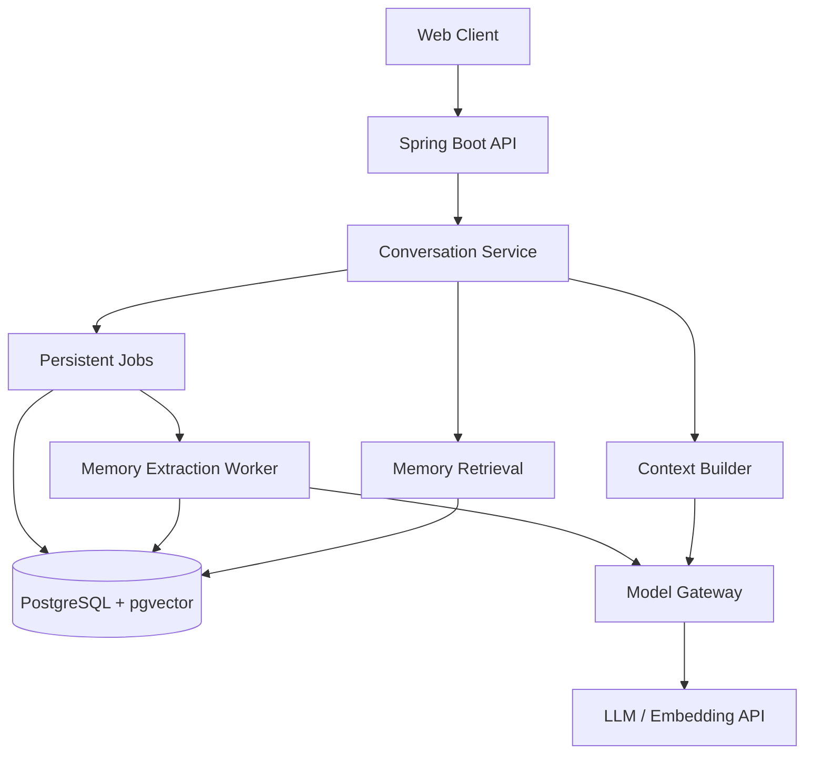
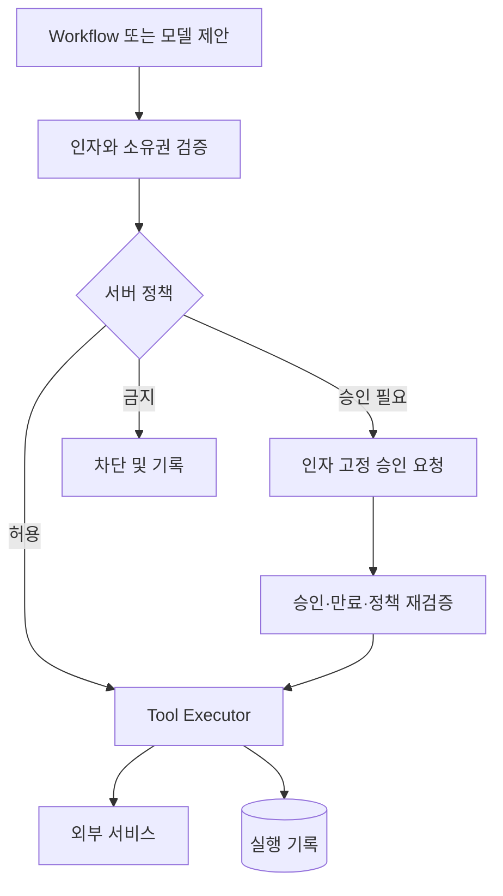

# (아카이브) ieum — Spring 기반 MVP 설계 및 개발 백로그

작성일: 2026-09-15 · 상태: 구현 전 설계 제안 v0.1 · **보관용 대안 설계**

> 이 문서는 현재 계획이 아니다. 프로젝트 초기에 Java/Spring 기준으로 검토한 설계를 기록으로 남긴 것이며, 작성 당시 서비스 가칭은 `Personal AI`였다. 현재 계획의 기준은 `docs/01`~`docs/04` 네 문서이고 스택은 Next.js·TypeScript·Supabase·Vercel이다(D03~D05). 아래 스택·작업 번호·기간·수치를 현재 계획으로 적용하지 않는다. 본문은 당시 내용 그대로 보존한다.

## 0. 프로젝트 결정

**사용자가 이야기한 목표·선호·중요 사건을 근거와 함께 기억하고, 다음 대화와 하루 브리핑에 활용하는 1인용 AI 비서.**

첫 배포는 Memory 중심 v0.1, 매일 사용하는 완성 범위는 브리핑을 더한 v0.2로 나눈다. 사용자가 제시한 방향을 구현 가능한 수준으로 좁힌 설계이며, 아래 기간·성능·품질·비용 수치는 측정 결과가 아닌 초기 계획 또는 실험 목표다.

- Backend: Java 21, Spring Boot, Spring Security, Spring AI 어댑터, Spring MVC, PostgreSQL + pgvector, Flyway.
- 단일 Gradle 프로젝트, 도메인별 패키지, 단일 배포. Boot/Spring AI는 구현 시작 시 공식 호환 조합으로 버전을 고정한다.
- Web: 최소 React 화면. 응답 스트리밍은 POST + fetch 스트림(SSE 형식). WebSocket은 음성 단계에서 검토한다.
- 모델: 실제 대화 Provider 1개, 추출용 저비용 모델, 고정된 Embedding 모델 1개. 두 번째 Provider는 v0.1 완료 직전 교체 검증용으로 추가한다.
- 운영: Docker Compose로 앱과 PostgreSQL 시작. Redis, Kafka, Kubernetes, 별도 Vector DB는 초기 제외한다.
- 실시간 음성·OS 제어·자유로운 Agent 루프는 MVP 이후다. 도구 권한 검사는 최초 연동부터 필수다.

## 1. 핵심과 범위 축소

| 아이디어 | 결정 | 구현 범위와 이유 |
| --- | --- | --- |
| 세션을 넘는 기억 | v0.1 핵심 | 사용자 사실·선호·목표·사건을 저장하고 근거 표시 |
| Episodic / Semantic Memory | v0.1 핵심 | 테이블을 나누지 않고 memory.kind로 구분 |
| Working Memory | v0.1 핵심 | 최근 대화 + 커서가 있는 요약 |
| User Model | v0.1 축소 | 활성 목표·확인된 선호를 조회해 만든 Context. 별도 인격 추론 없음 |
| Relationship Memory | 연기 | 사람이 포함된 사건은 저장하되 관계 그래프·동명이인 자동 통합은 제외 |
| Habit / Procedural Memory | 연기 | 명시적 선호만 저장. 반복 발화를 습관이나 실행 권한으로 승격하지 않음 |
| 능동적 도움 | v0.2 제한 | 정해진 시각에 인앱 브리핑 1회. 상시 감시·개입 판단 제외 |
| 개발 정보 | v0.2 포함 | 사용자가 등록한 RSS 3~5개, 관심 태그, 읽음·유용함 피드백 |
| Calendar | v0.2 포함 | 지정 캘린더의 일정 조회만 |
| Gmail | v0.3 | OAuth 범위와 본문 처리까지 별도 검증. 초기에는 조회 및 로컬 초안 |
| Slack / GitHub / Drive | 이후 | 매일 쓰는 한 서비스부터 순차 추가 |
| 실시간 STT / 힌트 / 화자 분리 | 이후 | 품질·지연·클라이언트 오디오 처리를 별도 실험으로 분리 |
| OS / 브라우저 Agent | 이후 | 허용된 액션만 있는 Companion. 임의 쉘 실행은 별도 범위 |
| 모델 독립성 | v0.1 포함 | 애플리케이션 DTO와 어댑터 경계. 모든 Provider 기능 통일은 하지 않음 |

포트폴리오에서는 서비스 개수보다 기억의 정정·검색 품질·실행 경계와 실패 복구를 설명한다.

## 2. 현실적인 MVP와 완료 기준

### v0.1 — 기억을 검증할 수 있는 대화

사용 시나리오:

1. 사용자가 “현재 목표는 Spring 백엔드 취업 준비야”라고 말한다.
2. AI가 해당 발화에서 목표 후보를 추출한다. 사용자는 기억함에서 출처를 보고 수정·삭제할 수 있다.
3. 새 대화에서 “이번 주 무엇부터 공부할까?”라고 물으면 활성 목표를 반영한다.
4. “취업했고 이제 Kafka 운영 역량을 키우고 싶어”라고 바꾸면 이전 목표는 종료되고 새 목표가 적용된다.
5. 모르는 개인 이력을 질문하면 추측해서 기억을 만들지 않는다.

화면은 대화, 기억함, 설정/사용량 3개다. 답변마다 ‘참고한 기억’을 접어서 보여준다. 모델에 전달한 기억과 모델이 실제 인용한 기억은 구분한다.

포함: 단일 계정 인증, 대화 저장/스트리밍, 선택적 기억 추출, 기억 검색, 정정·삭제, 출처, 모델 사용량, 실패 작업 재시도.

제외: 일정/메일 연동, 음성, 실행 Agent, 개인 성격 추론, 범용 파일 업로드 RAG, 고급 UI.

### v0.2 — 매일 사용하는 브리핑

RSS + 지정 Calendar 조회 + 사용자가 직접 등록한 오늘 할 일/미완료 목록으로 아침 브리핑을 만든다. 단순 task 레코드만 추가하고 완전한 Todo 앱을 만들지 않는다. 일정은 Calendar가 원본이며 Memory가 오늘 일정의 진실을 대신하지 않는다.

매일 지정 시간대에 브리핑을 저장하고 인앱 배지로 알린다. 앱이 닫혀 있을 때 OS 알림을 보장하려면 별도 Push 구독이 필요하므로 v0.2에는 포함하지 않는다. 서버는 해당 시각에 실행 중이어야 한다.

### 평가 기준

| 항목 | 초기 완료 기준 |
| --- | --- |
| 평가셋 | 개인 대화를 본뜬 고정 시나리오 30개. 검색 조정용 20개, 보류 검증용 10개 |
| 기억 검색 | 정답 기억이 있는 질문에서 Recall@5 80% 이상을 초기 목표로 측정 |
| 정정 | 명시적 정정 5개 시나리오에서 옛 사실을 현재 사실로 사용하지 않음 |
| 삭제 | 검색·요약·프로필·추출 재시도로 삭제 기억이 부활하지 않음 |
| 근거 부족 | 미보유 정보 질문에 근거 없는 개인 사실을 만들어 답하지 않음 |
| 복구 | 프로세스 중단 후 미완료 기억 작업 재개, 중복 저장 방지 |
| 비용 | 호출별 입력/출력 토큰과 예상 비용, 실패/재시도 기록 |
| 브리핑 | 동일 실행 슬롯의 브리핑 중복 생성 방지, 실패한 수집원 표시 |

작은 평가셋 통과가 일반적 무오류를 의미하지는 않는다. 실제 사용 중 오류를 추가해 평가셋을 확장한다.

## 3. 시스템 아키텍처



API와 Worker는 같은 프로세스 안에서 실행한다. 다만 Worker는 DB 작업 테이블을 읽으므로 서버 재시작으로 작업이 사라지지 않는다. DB 연결·트랜잭션을 잡은 채 LLM 응답을 기다리지 않는다.

동기 경로:

1. 인증 사용자와 conversation 소유권 확인.
2. client_request_id로 중복 메시지를 방지하고 사용자 메시지를 저장.
3. 현재 발화, 최근 대화, 확정된 목표/선호, 관련 기억을 취합.
4. Context 토큰 예산 검증 후 모델 호출, 응답 스트리밍.
5. 답변 상태와 사용량을 저장. 메시지 저장 트랜잭션에서 등록한 추출 작업을 Worker가 처리.

답변 생성 실패가 사용자 발화 추출을 막지 않도록 추출은 저장된 사용자 발화 범위를 기준으로 한다. 한 conversation의 동시 생성은 v0.1에서 1건만 허용하고 두 번째 요청은 409로 거절한다. 생성 lease 만료로 프로세스 중단을 복구한다. 클라이언트 단절 시 부분 답변은 PARTIAL로 구분한다.

기억 추출은 응답 지연과 분리된다. 직전에 말한 내용은 추출 완료를 기다리지 않고 최근 대화에서 반영한다.

## 4. Backend 패키지 구조

루트 예: com.sejong.personalai. 초기에는 Gradle 멀티모듈로 쪼개지 않는다.

| 패키지 | 주요 객체 | 책임 |
| --- | --- | --- |
| identity | SecurityConfig, CurrentUser | 단일 계정 로그인, 소유권 확인 |
| conversation | ConversationService, MessageRepository | 대화 저장, 순서, 스트리밍 상태 |
| memory | MemoryExtractor, MemoryService, MemoryRetriever | 추출, 버전·충돌·삭제, 검색 |
| context | ContextBuilder, TokenBudget | 최근 대화/요약/기억 조합과 제한 |
| model | ModelGateway, EmbeddingGateway, ProviderAdapter | 공급자 호출, timeout, usage, 모델 선택 |
| jobs | JobDispatcher, JobRepository | 영속 작업, lease, 제한된 재시도 |
| observability | ModelCallRecorder, RetrievalTrace | 비용, 지연, 검색 결과와 실패 원인 |
| briefing | BriefingService | v0.2 수집 결과 선별·작성 |
| integration | CalendarConnector, RssConnector | v0.2 외부 서비스별 API 처리 |
| tool | ToolExecutor, ToolRegistry | v0.2 이후 검증된 도구 실행 |
| permission | PolicyService, ApprovalService | v0.2 조회 정책, v0.3 쓰기 승인 |

경계는 실제 교체 지점에만 둔다. Repository는 Spring Data를 사용하고, pgvector 검색 SQL은 JdbcClient 등으로 별도 작성할 수 있다. 모든 클래스를 Port/Adapter 인터페이스로 감싸지는 않는다.

ModelGateway는 generate/stream 및 구조화 결과 요청 정도만 제공한다. 요청 DTO에는 taskType, messages, outputLimit, schemaVersion을 둔다. 결과에는 content, finishReason, usage, providerRequestId를 포함한다. Embedding은 별도 인터페이스로 분리한다.

Spring AI는 모델 연동 어댑터로 활용한다. 공식 ChatMemory는 현재 대화에 필요한 메시지를 관리하는 기능이며 전체 대화 이력 저장과 구분된다. 이 프로젝트의 장기 기억·정정 정책은 자체 도메인으로 구현한다. [Spring AI Chat Memory](https://docs.spring.io/spring-ai/reference/api/chat-memory.html)

## 5. DB와 Memory 구조

### v0.1 테이블

| 테이블 | 주요 컬럼 | 용도 |
| --- | --- | --- |
| app_user | id, timezone, preferences_json, memory_epoch | 사용자 설정과 삭제 작업 경합 방지 |
| conversation | id, user_id, title, summary, summary_through_seq, summary_valid, generation_lease_until | 현재 대화와 요약 범위 |
| message | id, user_id, conversation_id, seq, role, content, status, client_request_id, memory_allowed, created_at | 원문, 생성 상태, 기억 제외 여부 |
| memory | id, user_id, kind, subject_key, predicate, value_json, content, status, confidence, importance, occurred_at, valid_from, valid_to, expires_at, supersedes_id, version | 기억과 변경 이력 |
| memory_evidence | id, memory_id, source_message_id, excerpt, source_kind | 기억을 뒷받침하는 근거. source_kind는 USER_STATEMENT 등 |
| memory_embedding | memory_id, memory_version, embedding_model, dimension, embedding, content_hash | 해당 기억 버전의 벡터 |
| job | id, user_id, type, payload_json, dedupe_key, status, attempts, available_at, lease_until, claim_token, memory_epoch | 추출·임베딩·삭제 등의 작업 |
| model_call | id, user_id, task_type, provider, model, input_tokens, output_tokens, estimated_cost, pricing_version, latency_ms, status, request_id | 호출 비용과 실패 관측 |
| retrieval_trace | id, user_id, message_id, memory_ids_json, score_components_json, prompt_version, input_token_count | 검색·Context 결정 설명 |

kind는 FACT, PREFERENCE, GOAL, EPISODE 네 가지로 시작한다. status는 CANDIDATE, ACTIVE, SUPERSEDED, DISPUTED, DELETED로 구분한다. 삭제 시 내용은 실제로 지우고 DELETED 레코드는 콘텐츠 없는 tombstone으로만 남긴다.

단일 사용자 서비스여도 user_id는 서버 인증에서 설정한다. 클라이언트가 지정한 user_id를 신뢰하지 않는다. 하위 레코드 소유권은 조회와 FK 설계로 일관되게 검사한다.

제약과 인덱스:

- message: UNIQUE(conversation_id, seq), UNIQUE(user_id, client_request_id).
- memory: INDEX(user_id, status, kind), INDEX(user_id, subject_key, predicate).
- memory_embedding: UNIQUE(memory_id, memory_version, embedding_model). 초기에는 고정 차원의 단일 모델만 사용.
- job: UNIQUE(user_id, dedupe_key), INDEX(status, available_at).
- 같은 단일값 사실을 정정할 때 대상 row 잠금 또는 version 기반 낙관적 잠금으로 변경 충돌을 막는다.
- vector 인덱스는 처음부터 필수로 만들지 않는다. 개인 데이터 규모에서 exact search 지연을 먼저 측정한다. pgvector는 기본 exact search를 지원하며 근사 인덱스는 속도와 recall 사이의 선택이다. [pgvector 공식 문서](https://github.com/pgvector/pgvector)

### 기억 예시

```json
{
  "kind": "GOAL",
  "subject_key": "self",
  "predicate": "career_target",
  "value_json": {"role": "Java Spring Boot backend developer"},
  "content": "사용자는 Java/Spring Boot 백엔드 개발자로 취업을 준비한다.",
  "status": "ACTIVE",
  "confidence": 0.95,
  "importance": 0.8,
  "valid_from": "2026-09-15T00:00:00Z",
  "evidence": {"source_message_id": "실제 저장된 메시지 ID"}
}
```

confidence는 모델이 산출한 내부 참고 점수이며 사실일 확률로 해석하지 않는다. 사용자 명시 발화, 확인 상태, 출처를 더 우선한다. 시점이 불명확하면 occurred_at을 null로 두며 작성일을 사건 발생일로 바꾸지 않는다.

### 저장 파이프라인

1. 최근 미처리 사용자 발화를 토큰 상한 내 배치로 모은다. 예: 5개 새 발화 또는 10분 유휴. ‘기억해줘’는 즉시 작업 등록.
2. 인사·일회성 일반 지식 질문 등은 간단한 규칙으로 제외하고, 남은 배치에서 1회 구조화 추출한다.
3. 모델은 후보와 근거 메시지 ID·인용 구간만 제안한다. 서버는 ID 소유권, 인용 일치, enum, 길이, 허용 키를 검증한다.
4. 어시스턴트의 추측·예시·외부 문서 내용은 사용자 사실의 근거로 채택하지 않는다. 명시적이고 비민감한 사실은 자동 활성화, 추론/모호함은 후보 상태로 둔다. 건강 등 민감 정보는 MVP 기본 자동 저장 제외, 명시 저장 요청 시만 처리한다.
5. 같은 subject/predicate 후보를 조회한다. 완전히 같은 내용은 근거만 추가한다. 모델이 재진술했다고 importance를 높이지 않는다.
6. 명시적 정정은 이전 기억의 valid_to를 닫고 새 버전을 ACTIVE로 만든다. 양립 가능한 복수 목표/선호는 유지한다. 애매한 충돌은 DISPUTED로 두고 질문 시 확인한다.
7. 승인된 기억만 임베딩한다. API 실패 시 기억은 남고 임베딩 작업만 재시도한다. 검색은 키워드로도 가능하다.

모든 종류에 ‘최신 정보가 무조건 승리’를 적용하지 않는다. 과거 사건은 그대로 남고 현재 상태만 달라질 수 있다. 반복 대화로 목표·성향을 자동 확정하는 기능은 이후에 별도 평가한다.

### 정정·삭제·원문 보관

- 기본 설계값: Raw Transcript 30일 보관 후 삭제, 기억 및 최소 근거 구간은 사용자 삭제 전까지 유지. UI에서 두 보관 범위를 구분한다. 사용자가 설정할 수 있게 한다.
- 원문 만료 후에는 원문 링크가 사라지고 ‘보관된 발췌 근거’만 남는다. 전체 원문을 숨겨둔 채 삭제했다고 표시하지 않는다.
- ‘기억 삭제’ 시 memory_epoch 증가, 기억 본문·벡터·발췌 제거, 관련 원문 memory_allowed=false, 파생 요약 무효화, 진행 중 작업 결과 commit 시 epoch 재검증을 수행한다.
- 한 메시지의 일부 기억만 삭제해도 MVP에서는 해당 원문 전체를 추출에서 제외한다. 세밀한 구간별 제외는 이후다.
- 삭제 기억의 출처가 포함된 기존 대화는 Context 재사용을 막고, 관련 요약은 폐기한다. 같은 대화의 과거 AI 답변에 복제된 내용도 있으므로 v0.1은 해당 대화의 이전 Context 전체를 비우는 보수적 처리를 한다. 원문 화면 보관 여부는 별도다.
- ‘원문까지 삭제’는 사용자 메시지, 관련 AI 응답/요약, 해당 원문에서 파생된 기억을 함께 삭제한다. 단순 대화 삭제도 기본적으로 이 경로를 쓴다.
- 로그에는 전체 프롬프트/메일 본문을 기본 저장하지 않는다. 백업은 암호화·기간 만료 정책을 두고 즉시 삭제 범위와 별도임을 명시한다. 복원 시 삭제 tombstone을 먼저 적용하고 서비스 재개 전에 제거 작업을 수행한다.

### v0.2 이후 추가 테이블

integration_account(암호화 토큰·scope·상태), source_item(외부 ID·제목·URL·발행일·해시·읽음), task(제목·상태·기한), automation_rule(시간대·다음 실행), automation_run(실행 슬롯·단계·오류), briefing(본문·수집 상태·근거), tool_execution(정규화 인자·정책 결과·실행 상태), approval_request(실행 ID·인자 해시·만료·승인자)를 필요한 단계에서만 추가한다.

## 6. Context와 Retrieval

### Context 구성

초기 입력 예산은 최대 8,000 토큰, 일반 답변 출력은 최대 1,000 토큰을 출발점으로 삼는다. 선택 모델의 한도와 실제 한국어 토큰량을 측정해 조정한다.

| 영역 | 초기 상한 | 처리 |
| --- | --- | --- |
| 시스템 규칙/출력 규약 | 800 | 애플리케이션이 통제하는 규칙만 |
| 사용자 기본 정보/활성 목표 | 400 | 확인된 사실 위주로 선별 |
| 대화 요약 | 800 | summary_through_seq 이후 원문과 중복 금지 |
| 최근 대화 | 2,500 | 최근 완결 턴부터 선택 |
| 검색 기억 | 1,500 | 3~8개 정도, 토큰 한도 우선 |
| 현재 질문/외부 관측 | 2,000 | 현재 질문 우선, 외부 내용은 잘라 넣음 |

각 영역 상한 합계는 8,000이다. 현재 질문이 영역 상한을 넘으면 다른 영역 예산을 줄이고, 전체 입력 상한도 넘으면 입력 축약/분할을 요청한다. 사용자 최신 질문을 몰래 잘라내지 않는다.

시스템 규칙, 현재 사용자 발화, 과거 기억, 외부 자료를 역할과 라벨로 분리한다. 메일/RSS/검색 기억을 고권한 system 지시문으로 올리지 않는다. 내용 안의 명령문은 참고 자료로만 다루되, 프롬프트 분리 자체를 보안 경계로 간주하지 않는다.

기억 블록에는 memory_id, content, 근거 유형, valid_from/valid_to, 상태를 넣는다. 모델이 인용한 ID는 실제 전달 목록에 속하는지 서버에서 확인한다. 사용자가 현재 정정한 내용은 저장 작업 전이라도 이전 기억보다 우선한다.

### 검색 절차

1. 현재 질문 + 바로 이전 1~2턴을 제한 길이로 검색 질의에 사용. 모든 질문에 별도 LLM rewrite를 호출하지 않는다.
2. user_id, status, 유효 기간, 민감정보 정책으로 후보 필터링. 현재 질문에는 ACTIVE, 과거 질문에는 해당 시점에 유효했던 SUPERSEDED까지 별도 포함.
3. 벡터 유사도 상위 20개 + 키워드/태그/프로젝트명 일치 상위 20개를 수집. 한국어 검색은 초기 exact substring·태그 매칭으로 시작하고 형태소 분석은 보류한다.
4. 두 순위를 RRF로 결합한다. RRF(m) = Σ 1/(60 + rank_i(m)). 60은 초기 실험값이며 검색 품질을 보장하는 값이 아니다.
5. RRF를 0~1로 정규화한 뒤 아래 보조 점수로 재정렬한다.

```text
score = 0.65 * normalizedRrf
      + 0.15 * goalOrProjectMatch
      + 0.10 * explicitImportance
      + 0.10 * typeAwareRecency
```

goalOrProjectMatch는 초기 태그/프로젝트 일치로 계산한다. 중요도·최근성 때문에 무관한 기억이 들어오지 않도록 키워드 또는 벡터 관련성 최소 조건을 먼저 통과시킨다. 벡터 임계값은 임베딩 모델별 평가셋으로 정하며 다른 프로젝트의 값을 그대로 복사하지 않는다.

6. 중복 내용, 동일 사실의 구버전, 동일 사건에서 과도하게 나온 기억을 제거한다. 최종 3~8개를 토큰 예산 안에서 선택한다. 적합한 기억이 없으면 0개를 허용한다.
7. 필요한 핵심 선호는 검색과 별도로 최대 400토큰 기본 정보 영역에 넣는다. 중요 사실은 오래됐다는 이유만으로 탈락시키지 않는다.

최근성은 타입별로 다룬다. 최근 작업 EPISODE는 시간 감쇠를 적용하고, 명시적으로 유지 중인 목표/선호는 변경·만료 여부를 우선한다. ‘지난달에는?’처럼 시간 조건이 있는 질의는 현재값만 필터링하지 않는다. 일정의 현재 상태는 도구 조회로 확인한다.

### 비교 실험

동일 모델·동일 프롬프트·고정 평가셋에서 A: 최근 대화만, B: vector top-k, C: hybrid + 시점/정정 처리를 비교한다. Recall@5, 잘못된 현재 사실 사용, 근거 없는 개인 정보 생성, 평균 입력 토큰, 검색 p95를 기록한다. 조정용과 보류셋을 구분해 가중치 과적합을 줄인다. LLM judge만 믿지 않고 사람이 정답 기억과 사실 반영을 확인한다.

## 7. Automation / Tool / Permission

### 자동화는 정해진 Workflow부터

v0.2는 Scheduler → 수집 → 중복 제거 → 규칙 선별 → LLM 요약 1회 → 브리핑 저장이다. LLM이 다음 도구를 계속 선택하는 루프는 사용하지 않는다.

- rule에 IANA timezone(예: Asia/Seoul), 다음 실행 시각 UTC 저장.
- UNIQUE(rule_id, scheduled_for)로 같은 슬롯 중복 실행 방지.
- DB job claim은 짧은 트랜잭션에서 잠금 후 lease/claim_token 발급. 외부 호출은 잠금 해제 후 수행.
- Worker 완료 처리 시 claim_token 일치 검사. 실패는 지수 backoff와 최대 3회 재시도, 이후 FAILED.
- 서버가 꺼졌다면 v0.2 정책상 최근 놓친 브리핑 1건만 보충하고 과거 슬롯 전체를 실행하지 않는다.
- 수집원 하나 실패 시 다른 결과로 브리핑을 만들고 ‘Calendar 조회 실패’처럼 누락을 표시한다. 0건 조회와 조회 실패를 구분한다.

RSS는 사용자가 등록한 주소만 조회하고 URL canonicalization + content hash로 중복 제거한다. 리다이렉트마다 내부 IP·메타데이터 주소 접근을 차단하고 응답 크기/시간 상한을 둔다. 처음에는 feed 본문과 공개 원문 링크를 사용하고 임의 웹 크롤러를 만들지 않는다.

‘읽음’은 사용자가 표시한 상태를 기준으로 한다. ‘이미 알고 있음’은 클릭했다고 추론하지 않고 ‘너무 기초적/유용함/관심 없음’ 피드백으로 조정한다. 글 선정 결과에는 원문 URL, 발행일, 선정 이유를 넣는다.

### 도구 실행 경계



| 동작 | 초기 정책 | 구체적 경계 |
| --- | --- | --- |
| 지정 Calendar 조회 | 자동 허용 | 연결 계정/캘린더 ID/기간 제한 |
| Gmail 검색·조회 | v0.3 자동 허용 | 읽기 scope, 건수·본문 길이 제한 |
| 중요 메일 분류 | 로컬 결과 저장 | Gmail 라벨 변경은 별도 쓰기 동작 |
| 메일 초안 생성 | 로컬 DB에 자동 저장 | Gmail 서버의 draft 생성과 구분 |
| Calendar 일정 생성 | v0.3 승인 | 캘린더·시간대·시작/종료·참석자·설명 고정 |
| 메일 전송 | 후속 승인 기능 | 받는 사람·CC/BCC·본문·첨부까지 확인 |
| 파일 삭제·결제·임의 명령 | 초기 금지 | 승인 버튼 자체를 제공하지 않음 |

LLM은 toolName과 arguments만 제안한다. risk, requiresApproval, userId, OAuth token, 실제 HTTP endpoint는 서버가 결정한다. 도구명·인자는 스키마 및 서비스별 제한으로 검증한다. 자연어 메모리의 ‘다음부터 그냥 보내’는 권한 정책을 바꾸지 못한다.

Spring AI의 자동 실행을 무심코 활성화하지 않고, 애플리케이션이 실행을 통제하는 경로를 사용한다. 공식 문서는 도구 실행을 사용자가 통제하는 방식을 제공한다. [Spring AI Tool Calling](https://docs.spring.io/spring-ai/reference/api/tools.html)

### 승인과 중복 실행

approval_request에는 정규화된 인자, arguments_hash, 사용자, 대상 연결 계정, policy_version, expires_at, 상태를 저장한다. 화면은 모델이 만든 축약문만 보여주지 않고 실제 실행 인자를 렌더링한다.

승인 시 로그인 사용자와 요청 소유권, 만료, 인자 해시를 확인하고 APPROVED → EXECUTING을 원자적으로 전환한다. 인자가 바뀌면 기존 승인은 무효다. 실행 직전 최신 권한과 연결 상태를 다시 확인한다.

외부 쓰기 API는 DB 상태 전이만으로 exactly-once가 되지 않는다. Provider idempotency key나 요청 ID를 지원하면 사용하고, timeout 후 성공 여부가 불명확하면 UNKNOWN으로 두고 조회로 확인한다. 확인 없이 자동 재전송하지 않는다. 중복 승인/서버 중단/외부 timeout을 테스트한다.

### Prompt Injection에 대한 실제 한계

정책 계층은 금지된 Tool 실행을 차단할 수 있지만, 허용 범위 안의 잘못된 분류나 잘못된 요약까지 완전히 막지는 못한다. 읽기만 하는 흐름도 외부 모델로 개인 데이터가 전달된다. 모델 전송 정보의 최소화·민감 필드 제거·외부 전송 대상 제한을 함께 적용한다.

OAuth 토큰은 서버에서 암호화 보관하고 키는 DB와 분리한다. 세션 인증에는 HttpOnly/Secure 쿠키와 CSRF 방어를 적용한다. 도구 로그에는 비밀값을 남기지 않는다.

Gmail은 단순 조회도 restricted scope가 포함될 수 있다. gmail.compose는 초안 관리뿐 아니라 전송 권한도 포함하므로 ‘초안만 필요하니 compose를 받아도 안전하다’고 판단하지 않는다. 로컬 초안부터 시작하고 배포 대상에 따른 OAuth 검증 요구를 구현 시 확인한다. [Google Gmail scopes](https://developers.google.com/workspace/gmail/api/auth/scopes)

## 8. 구현 순서와 일정

주당 10~15시간 기준 초기 추정이다. OAuth와 모델 응답 품질에 따라 달라질 수 있다. v0.1 60~90시간, v0.2 추가 25~40시간, v0.3 추가 25~40시간 정도로 계획하고 완료 조건을 기준으로 조정한다.

| 단계 | 예상 시점 | 결과물 | 다음 단계 진입 조건 |
| --- | --- | --- | --- |
| A | 1주차 | 인증·DB·모델 호출·대화 저장 | 재시작해도 대화 복원 |
| B | 2~3주차 | 추출 Worker·기억함·정정 | 발화 근거 확인 및 중복 방지 |
| C | 4~5주차 | Retrieval·Context·삭제 | 새 대화 기억 활용, 변경/삭제 회귀 통과 |
| D | 6주차 전후 | 비용 제한·평가·배포 | v0.1 실사용, 두 번째 Provider smoke 검증 |
| E | 추가 2~4주 | RSS·Calendar·브리핑 | 7일 동안 실행 결과·실패 확인 |
| F | 이후 2~4주 | Gmail 조회·일정 생성 승인 | 중복 승인/timeout 테스트 통과 |
| G | 사용성 확인 후 | 음성 실험 | 텍스트 서비스가 유용하고 유지 가능한 상태 |

음성 순서는 사용자가 녹음 시작/종료하는 STT → 종료 요약 → 스트리밍 STT → 제한적 힌트 → 화자 분리다. 실시간 힌트는 STT 잠정 결과 수정, 침묵 구간 감지, 발화 종료부터 힌트 표시까지 p50/p95를 측정한다. 상대가 질문하는 도중 의미를 확정하는 문제도 따로 평가한다. 항상 켜진 마이크는 초기 실험에서 제외한다.

## 9. API 비용 최적화

### 호출 예산

| 작업 | 초기 호출 정책 |
| --- | --- |
| 일반 대화 | 모델 생성 1회 + 검색 필요 시 질문 임베딩 1회 |
| 기억 추출 | 새 발화 배치당 저비용 모델 1회 |
| 기억 임베딩 | 새로 활성화되거나 변경된 내용만, content_hash 재사용 |
| 대화 요약 | 입력 예산 초과가 예상될 때만, 미요약 범위만 |
| 브리핑 | 규칙으로 줄인 후보를 묶어 모델 1회 |
| 재정렬 | 초기에는 애플리케이션 점수 계산, 별도 LLM 호출 없음 |
| 강한 모델 | 명시적 요청 또는 제한된 복잡 작업만, 기본 자동 승격 없음 |

30일·하루 대화 20턴을 가정하면 월 생성 600회다. 평균 입력 4,000/출력 600토큰이면 생성 입력 240만/출력 36만 토큰이다. 추출을 하루 4회, 입력 2,000/출력 300토큰으로 가정하면 월 입력 24만/출력 3.6만 토큰이 추가된다. 브리핑 하루 1회, 입력 6,000/출력 800토큰이면 월 입력 18만/출력 2.4만 토큰이 추가된다.

**합계 입력 282만, 출력 42만 토큰**이며 임베딩·요약·재시도·추가 추론 토큰·외부 Tool 사용료는 별도다. 이는 사용량 시나리오이지 특정 모델의 실제 요금 견적이 아니다.

```text
월 모델 비용 = Σ 작업별 (입력토큰/1,000,000 × 입력단가
                         + 출력토큰/1,000,000 × 출력단가)
              + 임베딩 + 기타 과금 항목
```

모델마다 단가가 다르므로 작업별로 계산한다. 실제 Provider 선택 시 공식 가격표 날짜와 가격 버전을 저장하고 SDK usage의 과금 대상 항목을 확인한다. 구독형 챗봇 비용과 프로젝트 API 예산은 분리해서 관리한다.

### 비용 통제

- 사용자 설정 월 예산(예: $15는 목표 상한 예시, 예상 청구액 아님), 일 예산, 작업별 출력 상한.
- 호출 전 예상 최대 비용을 DB에서 원자적으로 예약하고 종료 후 usage로 정산한다. 동시 호출이 각자 잔액을 보고 예산을 초과하지 않게 한다.
- usage 미확인/네트워크 timeout은 비용 0으로 단정하지 않고 예약 비용을 보수적으로 유지한다. Provider 청구와 주기적으로 비교한다.
- 80% 사용 시 강한 모델·선제 요약을 중지하고 예산 소진 시 유료 생성 작업 중단. 기존 기록 조회는 유지한다.
- 임베딩 공급자 장애 시 키워드 검색으로 저하, 생성 실패 시 제한된 재시도. 자동 공급자 전환은 중복 청구 가능성을 기록한다.
- 처음에는 개인 기억/프롬프트 응답 캐시를 만들지 않는다. 오래된 정정/삭제 정보가 남는 위험과 무효화 비용이 더 크다.
- 모델 변경 시 생성 엔진과 임베딩 모델 변경을 구분한다. 임베딩 공간이 다른 벡터는 혼용할 수 없으므로 새 버전 재임베딩 후 검색 전환이 필요하다.

## 10. 구체적 개발 Task

각 Task는 코드뿐 아니라 완료 조건까지 포함한다. P0=v0.1, P1=v0.2, P2=v0.3 이후. 예상 일정은 위 단계 범위이며 개별 Task는 대체로 반나절~이틀 작업을 목표로 쪼갠 것이다.

| ID | 우선 | 작업 | 선행 | 완료 조건 |
| --- | --- | --- | --- | --- |
| T01 | P0 | 저장 대상/정정/삭제/모르는 정보 시나리오 30개 작성 | 없음 | 정답 기억·기대 답변·금지 결과 정의 |
| T02 | P0 | Boot·Java·Spring AI 호환 버전 고정, Compose/Flyway | 없음 | 빈 DB에서 앱 구동/마이그레이션 성공 |
| T03 | P0 | 단일 계정 인증·쿠키·CSRF·소유권 검사 | T02 | 비인증/다른 conversation 접근 거절 |
| T04 | P0 | ModelGateway + Provider 1개 + usage/timeout | T02 | 요청/응답/오류와 비용 정보 기록 |
| T05 | P0 | conversation/message 저장·멱등 키·생성 lease | T03 | 중복 요청/동시 요청/재시작 처리 |
| T06 | P0 | POST 스트리밍 응답과 최소 대화 UI | T04,T05 | 완료/부분/실패 응답 구분 및 새로고침 복원 |
| T07 | P0 | memory/evidence 스키마와 수동 등록 API | T02,T03 | 기억과 사용자 발화 근거 조회 |
| T08 | P0 | DB job claim·lease·재시도·dedupe | T02 | Worker 강제 종료 후 재개, 이중 완료 거절 |
| T09 | P0 | 구조화 기억 추출 + 근거/스키마 검증 | T04,T07,T08 | 잘못된 ID/AI 발화 근거/잘못된 JSON 거절 |
| T10 | P0 | 배치 커서와 자동 추출 연결 | T05,T09 | 같은 발화 재처리 시 기억 중복 없음 |
| T11 | P0 | 정정·중복·충돌 상태 처리 | T10 | 단일값 정정/복수 목표/모호한 충돌 구분 |
| T12 | P0 | 기억함 UI, 확인·수정·출처 | T07,T11 | 사용자 수정 결과가 DB에 반영 |
| T13 | P0 | EmbeddingGateway·벡터 저장·exact search | T04,T07,T08 | 모델/버전 일치 검사, 실패 임베딩 재시도 |
| T14 | P0 | 키워드 후보·RRF·시점 필터·검색 trace | T11,T13 | 평가셋에서 기대 기억 및 점수 이유 확인 |
| T15 | P0 | Context 예산·요약 커서·기억 인용 검사 | T06,T14 | 초과 방지, 최근 대화 중복 없음 |
| T16 | P0 | 삭제·memory_epoch·재추출 차단·요약 무효화 | T08,T12,T15 | 진행 중 추출과 경합해도 삭제 기억 미복원 |
| T17 | P0 | 호출별 사용량·예산 예약·설정 UI | T04,T08 | 동시 호출에도 제한 적용, 실패 비용 추적 |
| T18 | P0 | A/B/C 검색 비교 및 오류 수정 | T01,T14,T15,T16 | Recall/오답/토큰/지연 비교표 산출 |
| T19 | P0 | Provider 2개째 어댑터 smoke 검증 | T15 | 같은 기억으로 대화/구조화 출력 전환 성공 |
| T20 | P0 | 배포·암호화 백업·복원·비밀값 로그 점검 | T16,T17,T18 | 복원 후 삭제 정책 유지, v0.1 사용 가능 |
| T21 | P1 | ToolExecutor와 READ 정책·실행 로그 | T20 | allowlist 밖 도구·대상 거절 |
| T22 | P1 | RSS 3~5개 수집·중복·읽음 피드백 | T21 | 같은 글 재수집해도 1건, 내부 주소 차단 |
| T23 | P1 | Calendar OAuth 조회·토큰 암호화/갱신 | T21 | 지정 캘린더만 조회, 만료/취소 오류 처리 |
| T24 | P1 | 간단 task 상태/기한 입력 | T20 | 미완료 항목을 조회할 수 있음 |
| T25 | P1 | 시간대 Scheduler·automation_run 멱등 | T08,T22,T23 | 같은 슬롯 1건, 중단 후 보충 정책 동작 |
| T26 | P1 | 브리핑 생성·근거 URL·부분 실패 표시 UI | T24,T25 | RSS/일정/할 일이 한 화면에 표시 |
| T27 | P1 | 7일 실사용 기록과 선정 기준 조정 | T26 | 누락·중복·유용함·일별 비용 기록 |
| T28 | P2 | Gmail 읽기와 로컬 답장 초안 | T21 | 전송 scope 없이 읽기/로컬 저장 |
| T29 | P2 | Approval DTO/UI·해시·TTL·원자 상태 전이 | T21 | 인자 변경·다른 사용자·재승인 거절 |
| T30 | P2 | Calendar 생성 Tool과 UNKNOWN 복구 | T23,T29 | 승인한 일정만 생성, timeout 중복 방지 |
| T31 | P2 | 악성 메일/기억 injection 회귀셋 | T28,T30 | 정책 변경·무승인 쓰기·범위 밖 전송 차단 |
| T32 | 이후 | 녹음 시작/종료 STT와 요약 실험 | T27 | 오디오 처리 결과·삭제·비용 확인 |

첫 착수 묶음은 T01~T05다. 첫 기술 검증은 고정된 짧은 대화 하나를 저장하고, 실제 Provider 응답과 usage를 기록한 뒤, 서버 재시작 후 대화를 복원하는 것으로 끝낸다. 이후 추출/검색을 한 번에 붙이지 않고 T07~T11로 기억 품질부터 확인한다.

## 11. 초기 API 계약

| Method | Path | 역할 |
| --- | --- | --- |
| POST | /api/conversations | 대화 생성 |
| GET | /api/conversations/{id}/messages | 저장된 대화 조회 |
| POST | /api/conversations/{id}/messages | clientRequestId/content 수신, 응답 SSE 스트림 |
| GET | /api/memories | 상태·타입·검색 조건으로 기억함 조회 |
| POST | /api/memories | 명시적 기억 수동 등록 |
| GET | /api/memories/{id} | 기억·근거·변경 이력 조회 |
| PATCH | /api/memories/{id} | expectedVersion과 수정값 전달, 충돌 시 409 |
| DELETE | /api/memories/{id} | 즉시 검색 차단 + 삭제 job, 202 및 jobId |
| GET | /api/jobs/{id} | 삭제/추출 작업 상태 확인 |
| DELETE | /api/conversations/{id} | 원문 및 파생 기억 삭제 작업 |
| GET | /api/usage | 기간별 토큰/비용/남은 예산 |
| GET | /api/briefings/today | v0.2 현재 시간대의 오늘 브리핑 |
| POST | /api/approvals/{id}/approve | v0.3 로그인 사용자 승인 |
| POST | /api/approvals/{id}/reject | v0.3 거절 |

SSE 이벤트는 token, done, error를 기본으로 하고 done에 messageId 및 전달/인용 memoryIds를 포함한다. 스트리밍 중 HTTP 상태를 변경할 수 없는 오류는 error 이벤트로 전달하고 DB 상태도 동기화한다. 재연결 시 저장된 메시지 조회로 복원한다.

## 12. 포트폴리오에서 보여줄 결과

1. 단순 vector top-k 대비 정정·시점·hybrid 검색이 어떤 실패를 줄였는지 고정 평가셋으로 설명.
2. LLM의 후보 추출과 서버의 근거 검증/상태 변경 책임을 분리한 이유.
3. 비동기 추출 중 삭제가 발생해도 기억이 부활하지 않는 처리.
4. 승인한 인자만 실행하고 외부 timeout의 불확실성을 관리한 방식.
5. 실제 7일 이상의 사용량·입력 토큰·비용·유용한 브리핑 비율. 측정 후 수치 기재.

처음 구현할 핵심은 ‘많이 기억하는 AI’보다 **기억의 출처와 변경을 관리하고 필요한 것만 사용하는 Backend**다. 이를 v0.1에서 검증한 뒤 브리핑과 제한된 실행 기능으로 확장한다.

## 참고한 공식 문서

- [Spring AI Chat Memory](https://docs.spring.io/spring-ai/reference/api/chat-memory.html): 현재 대화 메모리와 전체 이력 저장의 차이.
- [Spring AI ChatClient](https://docs.spring.io/spring-ai/reference/api/chatclient.html): 모델 호출 계층 구현 시 참고.
- [Spring AI Tool Calling](https://docs.spring.io/spring-ai/reference/api/tools.html): 애플리케이션이 도구 실행을 통제하는 경로.
- [pgvector](https://github.com/pgvector/pgvector): exact/approximate 검색과 필터링 동작.
- [Google Gmail scopes](https://developers.google.com/workspace/gmail/api/auth/scopes): 읽기·초안·전송 권한 범위.

문서의 아키텍처·점수 가중치·일정·예산은 이 프로젝트를 위한 제안이며, 공식 문서가 보장하는 구현 결과가 아니다.
